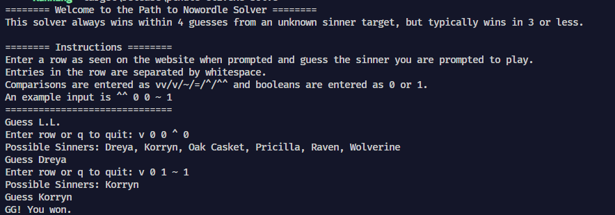

# ptndle-cli: A CLI tool for playing and solving [Path to Nowordle](<https://ptndle.com/>)

Path to Nowordle is now a solved game! Every Sinner can currently be guessed in 4 guesses or less, with only Shalom taking 4 guesses.

## Features

- Plays and solve games of Path to Nowordle
- Solve games from an initial set of guesses
- View statistical information about the solver
- Pool of sinners stays in sync with the site
- View information on the various sinners
- Written in 🚀Rust🔥
  
View the help for more in-depth information about the program.

## Gathered Data (as of 30/6/25)

```text
Goto first sinner to play: L.L.
It takes 4 or less guesses to guess any sinner.
    1 sinners take 1 guesses (0.89%)
    52 sinners take 2 guesses (46.43%)
    58 sinners take 3 guesses (51.79%)
    1 sinners take 4 guesses (0.89%)
The sinners that take the maximum number of guesses rounds are:
    Shalom
The mean number of guesses is 2.53
```

## Screenshots




## Installation

This program can be installed like any other Rust program

```bash
cargo install --path=.
```
